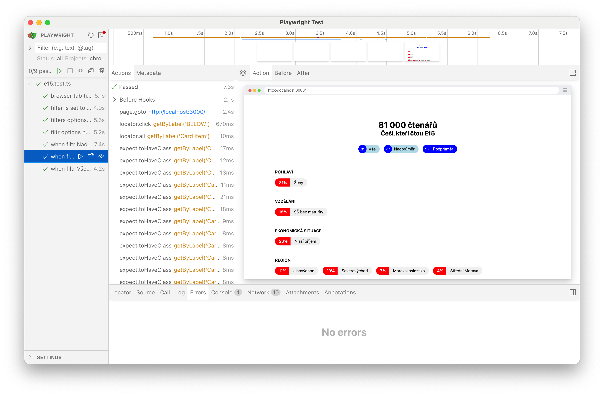

# Playwright tests

Tests were created by following get started on https://playwright.dev/docs/intro

Webserver is runned with tests using playwright config at the bottom of playwright.config.ts

## Component analysis

- filter has three options
- default option is called "Vše" and it shows all the avaliable data
- option 2 is called "Nadprůměr" when selected it shows above average data - green colour
- option 3 is called "Podprůměr" when selected it shows under average data - red colour
- when switching between options in filter, selected button gets highlighted
- each filter has different icon
- filter options have aria labels all, above, below

## Testing strategy

I choose playwright framework, because it's the one I have most experiences and I am learning it.

- first I studied the behaviour of the filtr component (interaction with user, edge cases)
- I checked its impact on the rest of the webpage
- I identify scope of testing
- I identify scope of automation vs manual
- I executed manual testing
- I created automated tests
- I executed automated tests and verified the results
- I commented steps in tests

For creating tests I was using playwritght UI mode:

npx playwright test --ui

## Not covered by Playwright tests

Some of the tests were not automated due to them being very fast to test manualy,
not ready for automation (would improve test IDs first), lack of experience (load testing),
or them being more suitable for visual testing (colours and layout),
or being out of scope of the interview task

- webpage responsive design
- page is scrollable
- loadings and error states
- performance tests - load time
- zobrazit více/zobrazit méně (not a part of filter, slightly difficult to test due to rerender/missing test IDs)
